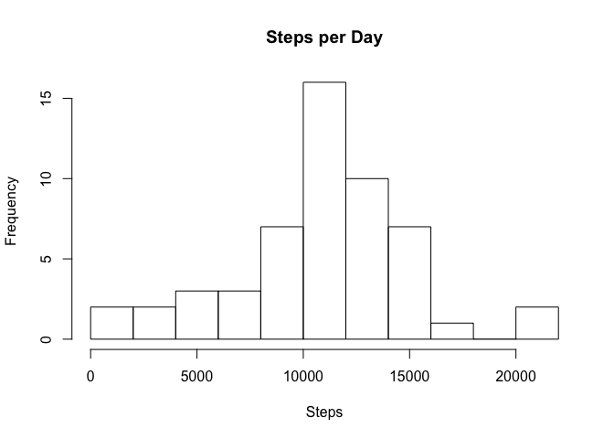
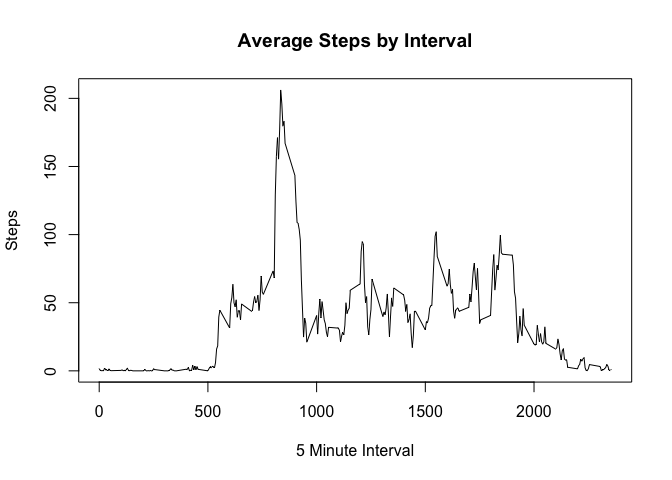
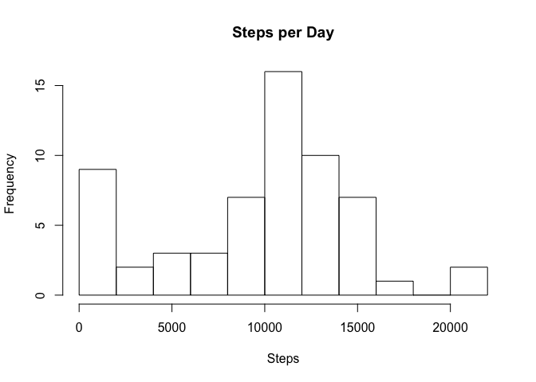

# Reproducible Research: Peer Assessment 1
Matthew Pemble  
14 December 2015  

## Loading and preprocessing the data


```r
## Initialise variables
data.directory <- "data"
datafile <- "activity.zip"
## Options set to prevent mean values displaying in scientific notation.
options("scipen"=100, "digits"=8)

## Check to see if there is a data directory
## If not, create it.
if (!file.exists(data.directory)) {
  dir.create(data.directory)
}

## Extract files from zip archive
datafile <- paste(".", data.directory, datafile, sep="/")
if (!file.exists(datafile))
{
  unzip("activity.zip", exdir = data.directory)
}

## Then extract & subset to get the relevant data
activity <- read.csv("data/activity.csv")
```

## What is mean total number of steps taken per day?


```r
require(dplyr)
```

```
## Loading required package: dplyr
## 
## Attaching package: 'dplyr'
## 
## The following objects are masked from 'package:stats':
## 
##     filter, lag
## 
## The following objects are masked from 'package:base':
## 
##     intersect, setdiff, setequal, union
```

```r
## Calculate the total number of steps taken per day
## Group by date (no conversion needed) and then summarize as a total
day_activity <- group_by(activity, date)
total_day <- summarize(day_activity,total=sum(steps))

## Make a histogram of the total number of steps taken each day, breaks is adjusted due to the large number of days involved.
hist(total_day$total,breaks=10,xlab="Steps", main="Steps per Day")
```

 

```r
## Calculate and report the mean and median of the total number of steps taken per day
step_mean <- mean(total_day$total,na.rm=TRUE)
step_median <- median(total_day$total,na.rm=TRUE)
```
### Report mean and median values.
The mean value is 10766.19.
The median value is 10765.

## What is the average daily activity pattern?


```r
## Make a time series plot (i.e. type = "l") of the 5-minute interval (x-axis) and the average number of steps taken, averaged across all days (y-axis)
## Group by interval and then summarize with mean(steps), remembering to remove NAs.
day_activity <- group_by(activity, interval)
average_day <- summarize(day_activity, average=mean(steps, na.rm=TRUE))
## Make the line plot
with (average_day,
     plot(interval,average, type="l", main="Average Steps by Interval", xlab="5 Minute Interval", ylab="Steps"))
```

 

```r
## Which 5-minute interval, on average across all the days in the dataset, contains the maximum number of steps?
step_maximum <- average_day$interval[which.max(average_day$average)]
```
### Report interval with maximum number of steps, on average
The interval with the greatest average number of steps is the 835'th interval.

## Imputing missing values

There are 2304 missing values in the activity data set.

### Devise a strategy for filling in all of the missing values in the dataset.
The initial strategy selection was to replace the missing data with the median value (to limit the impact of outliers) for that section of the day.  

It was noted that the first day (1 Oct 2012) was completely filled with NA values, therefore this day was excluded from the modified dataset. A more sophisticated analysis would have detected and similarly deleted any other days for which this condition applied.


```r
## Create a new dataset that is equal to the original dataset but with the missing data filled in.
## Create new dataset without Day 1
modified_activity <- filter(activity, date != "2012-10-01")
modified_activity$interval <- as.factor(modified_activity$interval)

## Create dataset with median activity values
day_activity <- group_by(activity, interval)
median_day <- summarize(day_activity, average=median(steps, na.rm=TRUE))

## Modify the new dataset
modified_activity[is.na(modified_activity$steps),"steps"] <- median_day$average

## Make a histogram of the total number of steps taken each day (copied from the first part)
## of the assessment
day_activity <- group_by(modified_activity, date)
mod_total_day <- summarize(day_activity,total=sum(steps))
hist(mod_total_day$total,breaks=10,xlab="Steps", main="Steps per Day")
```

 

```r
## Calculate and report the mean and median total number of steps taken per day. 
## Again, copied from the first part of the assessment.
mod_step_mean <- mean(mod_total_day$total)
mod_step_median <- median(mod_total_day$total)
```
### Report mean and median values for the modified data.
The mean value is 9643.25.
The median value is 10417.

### Do these values differ from the estimates from the first part of the assignment? 
The mean value is 1122.94 lower than the estimate.
The median value is 348 lower than the estimate.

## What is the impact of imputing missing data on the estimates of the total daily number of steps?

Because of the strategy selected for imputing missing data, the inserted values are significantly lower than the mean or median values.

This would imply that there is a signficant impact from high-value outliers in the measured data (i.e. the mean values for intervals, as opposed to daily totals, are signficantly greater than the median.)  This could reflect different biases to daily activity patterns.

## Are there differences in activity patterns between weekdays and weekends?

```r
## Create a new factor variable in the dataset with two levels – “weekday” and “weekend”
## indicating whether a given date is a weekday or weekend day.

## Generate additional column with day of week
modified_activity$week <- weekdays(as.Date(modified_activity$date))
modified_activity$week <- ifelse((modified_activity$week == "Saturday" | modified_activity$week == "Sunday"), "weekend", "week")
modified_activity$week <- as.factor(modified_activity$week)

weekday <- modified_activity[modified_activity$week=="week",]
weekend <- modified_activity[modified_activity$week=="weekend",]

weekday <- group_by(weekday, interval)
average_weekday <- summarize(weekday, average=mean(steps))

weekend <- group_by(weekend, interval)
average_weekend <- summarize(weekend, average=mean(steps))
## Make the line plot

par(mfrow=c(2,1))
with (average_weekday,
     plot(interval,average, type="l", main="Weekday by Interval", xlab="", ylab="Steps"))
with (average_weekend,
     plot(interval,average, type="l", main="Weekday by Interval", xlab="5 Minute Interval", ylab="Steps"))
```

 
