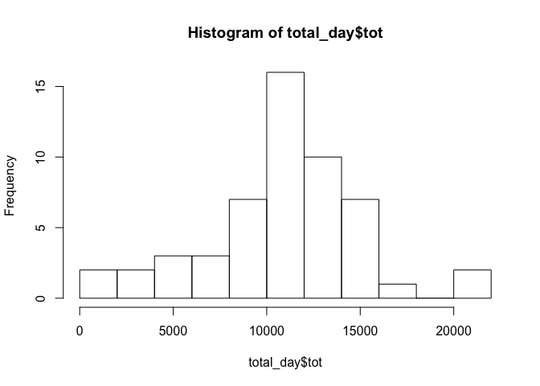
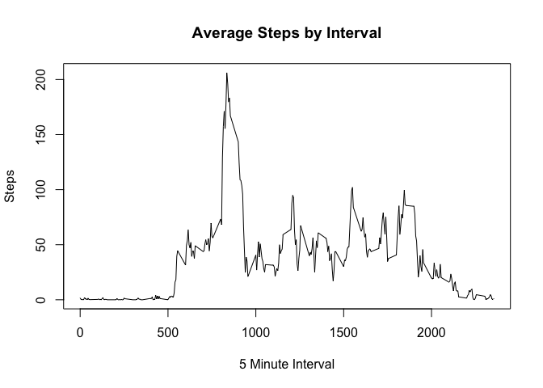

# Reproducible Research: Peer Assessment 1
Matthew Pemble  
14 December 2015  

## Loading and preprocessing the data


```r
## Initialise variables
data.directory <- "data"
datafile <- "activity.zip"

## Check to see if there is a data directory
## If not, create it.
if (!file.exists(data.directory)) {
  dir.create(data.directory)
}

## Extract files from zip archive
datafile <- paste(".", data.directory, datafile, sep="/")
if (!file.exists(datafile))
{
  unzip("activity.zip", exdir = data.directory)
}

## Then extract & subset to get the relevant data
activity <- read.csv("data/activity.csv")
```


## What is mean total number of steps taken per day?


```r
require(dplyr)
```

```
## Loading required package: dplyr
## 
## Attaching package: 'dplyr'
## 
## The following objects are masked from 'package:stats':
## 
##     filter, lag
## 
## The following objects are masked from 'package:base':
## 
##     intersect, setdiff, setequal, union
```

```r
day_activity <- group_by(activity, date)
total_day <- summarize(day_activity,total=sum(steps))
hist(total_day$total,breaks=10,xlab="Steps", main="Steps per Day")
```

 

```r
step_mean <- mean(total_day$total,na.rm=TRUE)
step_median <- median(total_day$total,na.rm=TRUE)
```
The mean value is 

```r
step_mean
```

```
## [1] 10766.19
```
The median value is

```r
step_median
```

```
## [1] 10765
```
## What is the average daily activity pattern?


```r
day_activity <- group_by(activity, interval)
total_day <- summarize(day_activity, average=mean(steps, na.rm=TRUE))
with (total_day,
plot(interval,average, type="l", main="Average Steps by Interval", xlab="5 Minute Interval", ylab="Steps"))
```

 

```r
step_maximum <- total_day$interval[which.max(total_day$total)]
```
The interval with the greatest average number of steps is the

```r
step_maximum
```

```
## integer(0)
```
interval.

## Imputing missing values


## Are there differences in activity patterns between weekdays and weekends?
