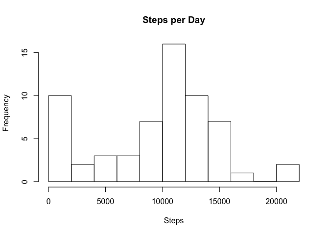
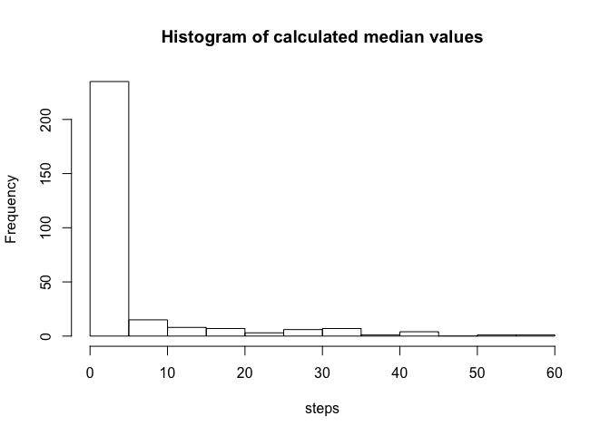
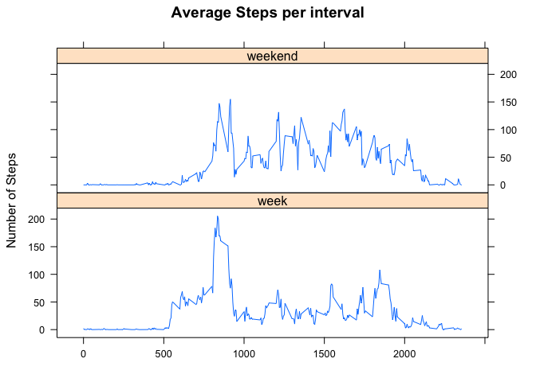

# Reproducible Research: Peer Assessment 1
Matthew Pemble  
20 December 2015  

## Loading and preprocessing the data


```r
## Load relevant packages
require(dplyr)
```

```
## Loading required package: dplyr
## 
## Attaching package: 'dplyr'
## 
## The following objects are masked from 'package:stats':
## 
##     filter, lag
## 
## The following objects are masked from 'package:base':
## 
##     intersect, setdiff, setequal, union
```

```r
require(lattice)
```

```
## Loading required package: lattice
```

```r
## Initialise variables
data.directory <- "data"
datafile <- "activity.zip"
## Options set to prevent mean values displaying in scientific notation.
options("scipen"=100, "digits"=8)

## Check to see if there is a data directory
## If not, create it.
if (!file.exists(data.directory)) {
  dir.create(data.directory)
}

## Extract files from zip archive
datafile <- paste(".", data.directory, datafile, sep="/")
if (!file.exists(datafile))
{
  unzip("activity.zip", exdir = data.directory)
}

## Then extract & subset to get the relevant data
activity <- read.csv("data/activity.csv")
head(activity)
```

```
##   steps       date interval
## 1    NA 2012-10-01        0
## 2    NA 2012-10-01        5
## 3    NA 2012-10-01       10
## 4    NA 2012-10-01       15
## 5    NA 2012-10-01       20
## 6    NA 2012-10-01       25
```

```r
summary(activity)
```

```
##      steps                 date          interval      
##  Min.   :  0.000   2012-10-01:  288   Min.   :   0.00  
##  1st Qu.:  0.000   2012-10-02:  288   1st Qu.: 588.75  
##  Median :  0.000   2012-10-03:  288   Median :1177.50  
##  Mean   : 37.383   2012-10-04:  288   Mean   :1177.50  
##  3rd Qu.: 12.000   2012-10-05:  288   3rd Qu.:1766.25  
##  Max.   :806.000   2012-10-06:  288   Max.   :2355.00  
##  NA's   :2304      (Other)   :15840
```

## What is mean total number of steps taken per day?


```r
## Calculate the total number of steps taken per day
## Group by date (no conversion needed) and then summarize as a total
day_activity <- group_by(activity, date)
total_day <- summarize(day_activity,total=sum(steps))

## Make a histogram of the total number of steps taken each day, 
## breaks is adjusted due to the large number of days involved.
hist(total_day$total,breaks=10,xlab="Steps", main="Steps per Day")
```

 

```r
## Calculate and report the mean and median of the total number of steps taken per day
step_mean <- mean(total_day$total,na.rm=TRUE)
step_median <- median(total_day$total,na.rm=TRUE)
```
### Report mean and median values.
The mean value is 10766.19 steps.  
The median value is 10765 steps.

## What is the average daily activity pattern?


```r
## Make a time series plot (i.e. type = "l") of the 5-minute interval (x-axis) 
## and the average number of steps taken, averaged across all days (y-axis)
## Group by interval and then summarize with mean(steps), remembering to remove NAs.
day_activity <- group_by(activity, interval)
average_day <- summarize(day_activity, average=mean(steps, na.rm=TRUE))

## Make the line plot
with (average_day,
     plot(interval,average, type="l", main="Average Steps by Interval", xlab="5 Minute Interval",
          ylab="Steps"))
```

 

```r
## Which 5-minute interval, on average across all the days in the dataset, 
## contains the maximum number of steps?
step_maximum <- average_day$interval[which.max(average_day$average)]
```
### Report interval with maximum number of steps, on average
The interval with the greatest average number of steps is the 835th interval.

## Imputing missing values

There are 2304 missing values in the activity data set.

### Devise a strategy for filling in all of the missing values in the dataset.
The initial strategy selection was to replace the missing data with the median value 
(to limit the impact of outliers) for that interval of the day.  

It was noted that the first day (1 Oct 2012) was completely filled with NA values, 
therefore this day was excluded from the modified dataset. A more sophisticated 
analysis would have detected and similarly deleted any other days for which this 
condition applied.


```r
## Create a new dataset that is equal to the original dataset but with the missing data filled in.
## Create new dataset without Day 1
modified_activity <- filter(activity, date != "2012-10-01")
modified_activity$interval <- as.factor(modified_activity$interval)

## Create dataset with median activity values
day_activity <- group_by(activity, interval)
median_day <- summarize(day_activity, average=median(steps, na.rm=TRUE))

## Modify the new dataset
modified_activity[is.na(modified_activity$steps),"steps"] <- median_day$average

## Make a histogram of the total number of steps taken each day (copied from the first part)
## of the assessment
day_activity <- group_by(modified_activity, date)
mod_total_day <- summarize(day_activity,total=sum(steps))
hist(mod_total_day$total,breaks=10,xlab="Steps", main="Steps per Day")
```

 

```r
## Calculate and report the mean and median total number of steps taken per day. 
## Again, copied from the first part of the assessment.
mod_step_mean <- mean(mod_total_day$total)
mod_step_median <- median(mod_total_day$total)
```
### Report mean and median values for the modified data.
The mean value is 9643.25.
The median value is 10417.

### Do these values differ from the estimates from the first part of the assignment? 
The mean value is 1122.94 lower than the estimate.
The median value is 348 lower than the estimate.

## What is the impact of imputing missing data on the estimates of the total daily number of steps?

Because of the strategy (interval median) selected for imputing missing data, 
the inserted values are significantly lower than the mean or median values.

The graph below shows that a range of values were included in the media set:

```r
hist(median_day$average, main="Histogram of calculated median values", xlab="steps")
```

 

This would imply that there is a signficant impact from high-value outliers in 
the measured data (i.e. the mean values for intervals  
are signficantly greater than the median.)  This could reflect different biases 
to daily activity patterns or daily activities varying considerably from interval
to interval.

## Are there differences in activity patterns between weekdays and weekends?

```r
## Create a new factor variable in the dataset with two levels – “weekday” and “weekend”
## indicating whether a given date is a weekday or weekend day.

## Generate additional column with day of week
modified_activity$day <- weekdays(as.Date(modified_activity$date))

## Convert to "week" or "weekend" and then to factor
modified_activity$day <- ifelse(
     (modified_activity$day == "Saturday" | modified_activity$day == "Sunday"), "weekend",
     "week")
modified_activity$day <- as.factor(modified_activity$day)

## Generate the average steps grouped by interval and "week" or "weekend"
modified_activity <- group_by(modified_activity, interval, day)
average_activity <- summarize(modified_activity, average=mean(steps))
average_activity$interval <- as.numeric(average_activity$interval)

## Make a panel plot
xyplot(
     average ~ interval | day, 
     data=average_activity, 
     type="l", 
     main="Average Steps per interval", 
     ylab="Number of Steps",
     xlab="",
## Force it not to be side by side
     layout = c(1,2))
```

 

There are clear differences between the weekend and week activities:  

- The weekday activity starts earlier.  
- The peak weekday activity is higher.  
- The overall level of weekend activity in the afternoons is higher than for the week days.
- Weekend activity continues somewhat later.

## Acknowledgements

As usual, function and syntax tips were gained from a variety of sources, including the lecture notes and examples from the previous course material:  

1. Books  
    + Kabacoff, Robert; R in Action  
    + Knell, Robert; Introductory R 
    
1. Websites  
    + R4stats.com  
    + blog.echen.me (particularly for ggplot2 - not used in the end)  
    + stackoverflow.com  
    + r-bloggers.com  
    + rstudio.com (package instructions & markdown cheat sheet)  
    + dummies.com (reminded me about the layout option for xyplot() )
